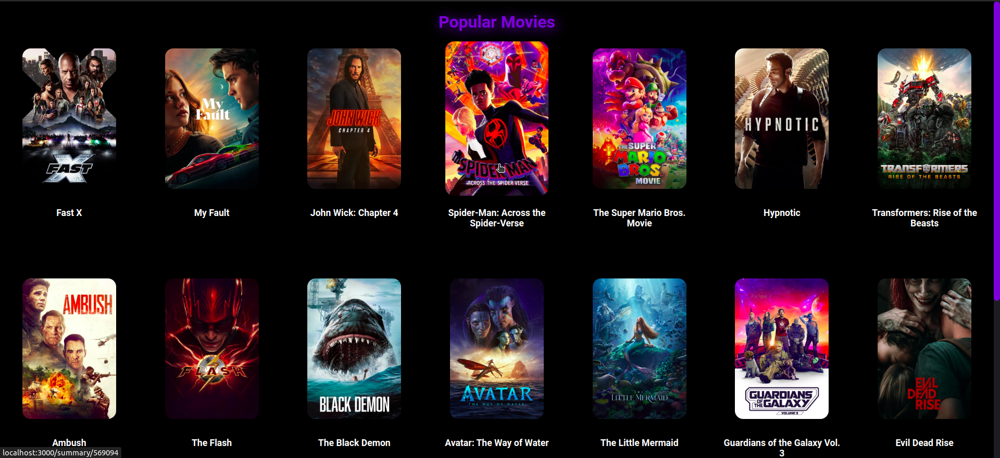
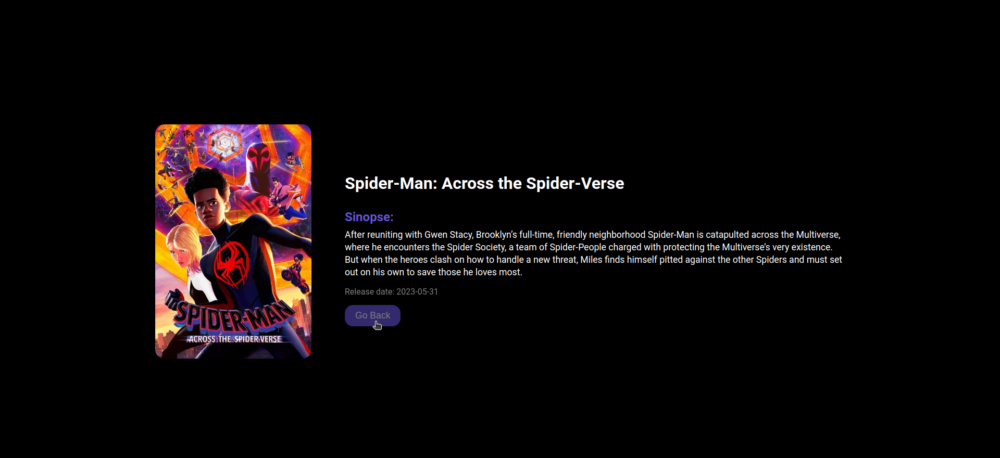

## Sobre

Desenvolvi esse projeto como estudo para reforçar meus conhecimentos em React e me aprofundar no consumo de API https://developer.themoviedb.org/docs.

---

## Tecnologias Utilizadas

Esse projeto foi desenvolvido com as seguintes tecnologias:

- [React](https://react.dev/)
- [Typescript](https://www.typescriptlang.org/)
- [Axios](https://axios-http.com/ptbr/docs/intro)
- [Styled Components](https://styled-components.com/)

---

## 📝 Pré-requisitos

Para rodar este projeto é necessário ter instalado na sua máquina as seguintes tecnologias:

- É necessário possuir o [Node.js](https://nodejs.org/en/) instalado na máquina.
- Também, é preciso ter um gerenciador de pacotes seja [Yarn](https://yarnpkg.com/) ou [NPM](https://www.npmjs.com/).

## Para rodar o projeto

1. Instale as dependências: `yarn`
2. Startar a aplicação: `yarn start`
3. Escolher o emulador da sua preferencia.

## 📷 Resultado

<h1 align="center">
    
    
</h1>
